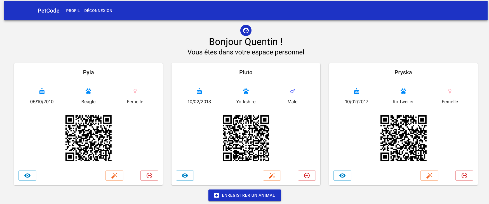
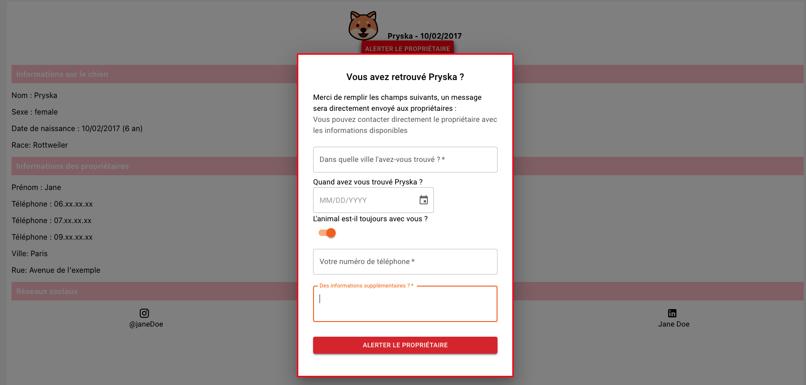

_Project is still under development, it is a personal project for now with no pre-defined roadmap_
# Petcode Application (Front-End)

Petcode is a ReactJS application for hosting a pet's information. It is a single page application that allows users to create, read, update, and delete their pet's information. The application is built with a Rails API backend and a ReactJS frontend. The application is styled with Semantic UI React and custom CSS.

Using petcode you can register default informations for your pet, such as name, breed, age, and weight. You can also add additional information such as allergies, medications, and vet information. You can also upload a picture of your pet to be displayed on the home page. This page is accessible through A QR code on your pet's medallion for exaample.

## 📸 Screenshot

Profile page when logged in : 



Qrcode Endpoint for a pet, where someone can report a lost pet :


## ⚙️ Installation

Execute the docker-compose up command from the root directory of the project to start the application. The application will be available at http://localhost:3000.

```bash
docker-compose up -d
```

_Do not forget to update your BACKEND environment variable to match the existing endpoint_

##  Usage

The application is a single page application that allows users to create, read, update, and delete their pet's information. The application is styled with Semantic UI React and custom CSS.

## 👋 Contributing

Pull requests are welcome. For major changes, please open an issue first to discuss what you would like to change.

